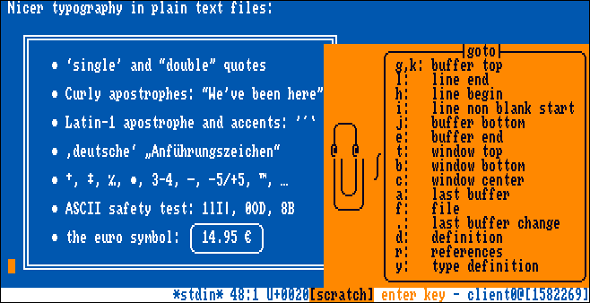

Topaz Unicode
=============

*A screenshot of the [Kakoune] editor,
using the Topaz Unicode font,
and an [Amiga Workbench] inspired colour scheme.
The editor is showing a portion of Markus Kuhn's [UTF-8 demo],
demonstrating some of the new characters added in this version,
like box-drawing characters and fancy punctuation.*

[Kakoune]: https://kakoune.org/
[Amiga Workbench]: http://toastytech.com/guis/amiga1.html
[UTF-8 demo]: https://web.archive.org/web/20231113055806/www.cl.cam.ac.uk/~mgk25/ucs/examples/UTF-8-demo.txt

What is this?
-------------

The [Amiga 500] came out in 1987,
and like the original Macintosh,
it boasted a full GUI but only a single ~800KB floppy drive.
Like the Mac,
in order for the computer to still be able to do useful things
while no disk was in the drive,
a lot of the resources required for the GUI were stored in ROM.
In particular,
the default UI font
was a monospaced, 8x8px font called Topaz
(although the default video mode was 640x200 pixels,
so drawing it at 8x16px on modern displays looks more authentic).

[Amiga 500]: https://en.wikipedia.org/wiki/Amiga_500

Topaz is therefore a highly nostalgic typeface
for people of a certain age and geographical distribution,
but it's also a genuinely good font.
It's high contrast,
it's consistently designed
(within the limits of 8x8px),
and it's quite compact.

As a monospaced font,
it'd be great for use in modern terminals,
except for a couple of problems:

  - It's a single-size bitmap font,
    and most modern operating systems have dropped support
    for anything but TrueType and OpenType scalable fonts.
  - The original font only supports the Latin-1 character set,
    so it doesn't support non-Latin writing systems,
    or even common terminal characters
    like box-drawing or blocks.

This project attempts to solve both these problems.

How was it made?
----------------

I started with the file `amiga-ks13-topaz-08.yaff`
from Rob Hagemans'
[Hoard of Bitfonts](https://github.com/robhagemans/hoard-of-bitfonts).

I converted it to the [Adobe Glyph Bitmap Distribution Format][BDF]
and doubled the height to 16 pixels
using [monobit](https://github.com/robhagemans/monobit)
bitmap font conversion software.

[BDF]: https://en.wikipedia.org/wiki/Glyph_Bitmap_Distribution_Format

I loaded the BDF into Kreative Korp's
[Bits'N'Picas][BNP] bitmap font editor,
and started drawing new glyphs.

[BNP]: https://github.com/kreativekorp/bitsnpicas/

All the original Topaz glyphs are present and unmodified,
except for character 0xDF "ß",
which was designed to be ambiguous between
U+00DF ß LATIN SMALL LETTER SHARP S and
U+03B2 β GREEK SMALL LETTER BETA.
Since Unicode gives each letter separate encodings,
I pasted the glyph into both locations,
and edited each one to more specifically depict
the letter it was supposed to be.

I added a whole bunch of new glyphs, including:

  - all the Windows Glyph List 4 characters,
    including Cyrillic, Greek, and the MS-DOS CP437 symbols
  - everything in the Box Drawing Unicode block
  - everything in the Block Elements Unicode block
  - a lot of things in the Symbols for Legacy Computing Unicode block
  - anything else that caught my eye or seemed useful

When drawing new glyphs,
I was very careful to constrain myself to the 8x8 pixel grid,
make vertical lines two pixels wide.
I also followed the model of the official Topaz glyphs:
for example, capital letters with a cedilla are raised up,
like the original `Ç`,
but small letters with a cedilla just have one pixel below them,
like the original `ç`.

Finally,
I used Bits'N'Picas to convert the font from BDF format
to TTF, which uses a special process
that guarantees the resulting font will render crisply at the target size.
I also generate a "Bold" version
that uses the same pixel-repeating trick that the original Amiga GUI used,
so that bold text will look crisp and authentic
instead of being antialiased by a modern font engine.

Where can I get it?
-------------------

You can download the latest versions of the TTF files
from [the artifacts page][artifacts].

[artifacts]: https://gitlab.com/Screwtapello/topaz-unicode/-/jobs/artifacts/main/browse?job=build

